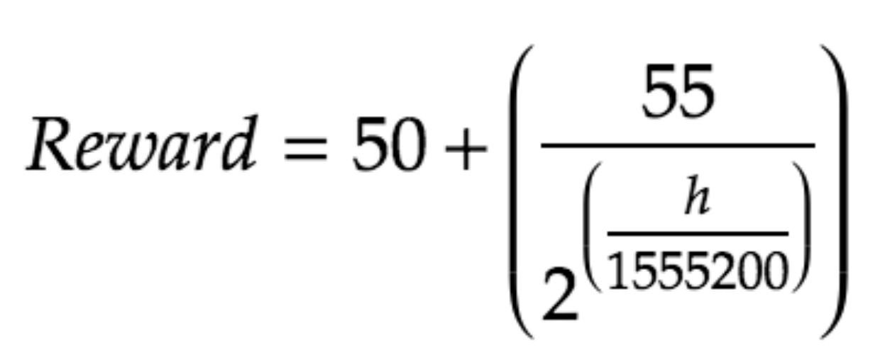
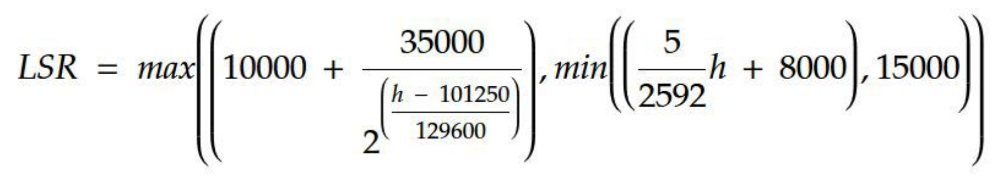
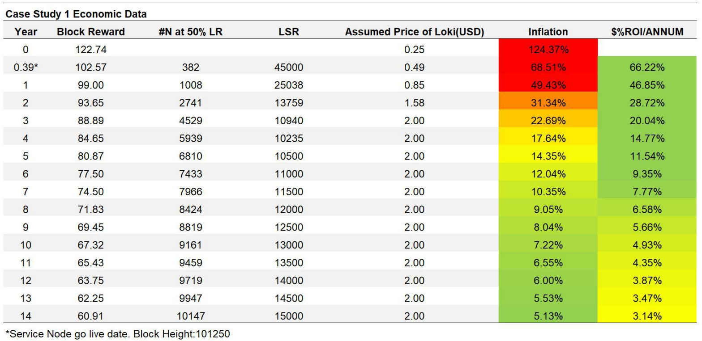
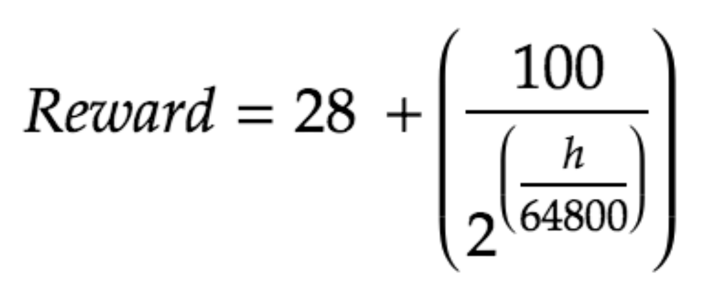
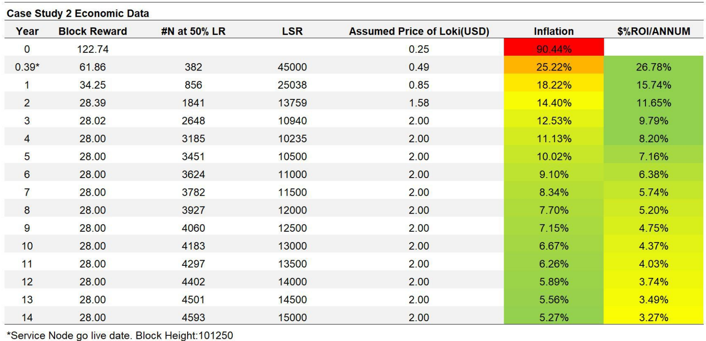
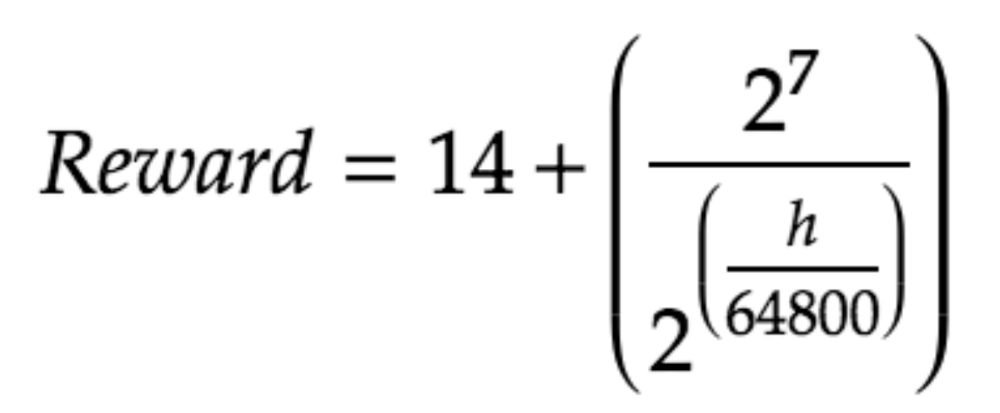
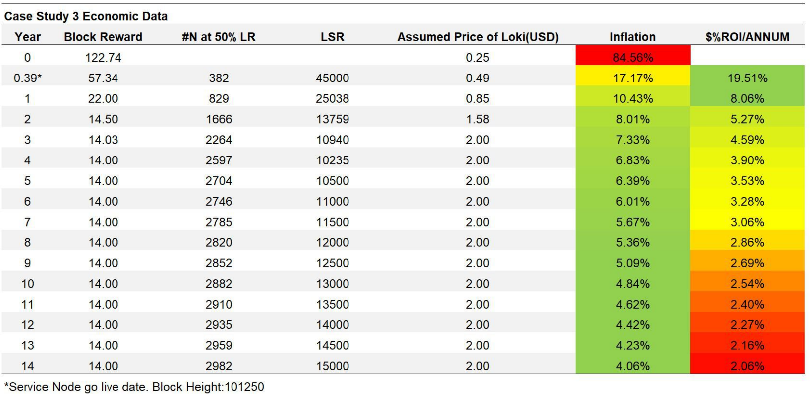

**Please Note that this LIP is historic in nature and therefor does not follow the LIP standard**
## Loki Cryptoeconomics 
#### Alterations to the staking requirement and emission curve.
##### Johnathan Ross, Simon Harman, Kee Jefferys
##### August 29th 2018

**Executive Summary**

The initial Loki emission curve did not suit a Sybil
attack resistant Service Node Network. We developed multiple case
scenarios which altered the Loki emission curve to find a model which
naturally promotes a reasonable percentage of the circulating supply
being locked up in Service Nodes to retain the Sybil attack resistant
properties of the network over the long term. We also altered the
staking requirement equation to match the conditions of the new emission
curve.

**Important notice**

This paper contains tables and charts which include
examples of a price for the Loki cryptographic coin. Those prices are
examples only and are not a prediction, forecast, or representation as
to any actual likelihood of price movement of the Loki cryptographic
coin. The payments shown in the examples below are general in nature and
will only take effect if the planned hard fork occurs. Factors outside
the control of Loki could impact what actual payments are made to
service nodes, for example in the event of an attack on the Loki
blockchain or there being bugs or errors in code.

Any references to the price of Loki in this paper are to the market
price of the Loki cryptographic coin available on public cryptocurrency
exchanges which choose to list the Loki token, noting that the Loki
Foundation does not operate a cryptocurrency exchange.

Those parties not operating a service node should not rely on the
examples when deciding whether or not to participate in the Loki
project. This document should be read together with the Loki whitepaper
published and other publications by Loki.

**Acronyms**

-   LSR - Loki Staking Requirement, staking requirement expressed in
    units of Loki.

-   $SR - Effective Dollar Staking Requirement, expressed in terms of
    fiat currency.

-   $OE - Operating Expenses, Real dollar annual cost of running a
    server for a Service Node.

-   LR - Lockup Ratio, proportion of ‘staked’ Loki in Service Nodes
    compared to circulating supply.

-   LROI - Loki Return on Capital Input, return on Loki compared to
    Loki input.

-   $ROI - Effective Dollar Return on Capital Input - LROI converted to
    fiat value, minus \$OE.

-   \#N - Active Service Node count at any given time.

## Introduction

A paper was commissioned by the Loki team to assess the viability of the
Loki Project’s initial cryptoeconomics. This [paper](https://loki.network/cryptoeconomics), written by
Dr Brendan Markey-Towler, an economist at the University of Queensland,
laid out the complex optimisation problem of setting the staking
requirement using strategic game theory. Using *Towler’s* paper we were
able to create a model which allowed us to assess the viability of
various case studies.

Through this modelling, we have formed the following views:

1.  Setting an optimal staking requirement is largely dependant on the
    emission curve and the price of Loki.

2.  The initial emission curve presented at Loki’s inception caused some
    economic problems for all models.

In this report, we outlined our vision of what a successful economic
structure should look like for Loki and discussed what is required to
enable such economics. We outlined the assessment made on the previous
economic model and 3 of the many case studies developed. Then we define
the new economic model, with alterations made to the emission curve,
reward split, and definition of the staking requirement.

## Desirable Economic Properties of Loki

One of the most important features of the Loki network is its built-in
market-based Sybil resistance. We defined a successful Sybil attack as
one where a single actor controls over 30% of the network’s nodes. At
this level of dominance, an actor could conduct effective network wide
temporal analysis. Forcing nodes to have a stake in the network greatly
increases the cost of performing a Sybil attack. *Towler* proved the
effectiveness of this protection in his game theory [model](https://loki.network/cryptoeconomics).

However, this protection is not guaranteed. Using game theory, we were
able to model the behaviour of rational economic actors, and built a
picture of what the net state of all Service Nodes at any given time
should be, given a set of economic conditions. Using this, we were able
to assess the potential difficulty and cost of executing a successful
Sybil attack on the network under varying conditions.

In an economic scenario where only 5% of the circulating supply is
locked up in Service Nodes, an attacker would only have to purchase
2.15% of the circulating supply in order to begin conducting effective
temporal analysis on the network. Although this attack would be costly,
the attacker would be unlikely to experience any compounding effect of
the attack cost as a result of their attack.

True market-based Sybil resistance only starts to materialise when a
greater percentage of the circulating supply is locked up in Service
Nodes. In a scenario where 90% of the circulating supply is locked,
actors would struggle to purchase enough Loki to perform an effective
temporal analysis. However, a 90% lockup is unlikely to occur as Loki
aimed to set its equilibrium Service Node lock up to 50% of the
circulating supply. In this scenario, an attacker would have to purchase
21.5% of the circulating supply to begin performing serious network wide
temporal analysis. Purchasing 21.5% of the circulating supply to
accomplish this level of saturation will cause liquidity to rapidly
decline in the markets, driving up the price of each coin as the
accumulation continues. Thus, we would see a compounding effect on the
cost of such an attack.

Of course, this accumulation can happen over time; depending on the
patience of the attacker. Assuming they stake the Loki as they
accumulate it, this would dilute the rewards that all Service Nodes
receive, including the attacker’s. *Towler’s* game theoretic model
showed that this would start to cause other Service Nodes to drop off
the network, but it would also come at an enormous opportunity cost to
the attacker. They would suffer a negative ROI in dollar terms for all
of their nodes as long as the node count remains above the natural
equilibrium point derived from a positive [$ROI](https://loki.network/cryptoeconomics).

The cost of this Sybil attack is based on the market price and liquidity
of Loki over the course of the attack, but assuming low estimates of
Loki’s price, this attack would easily run into the tens or hundreds of
millions of dollars. If an attacker could sustain these costs, they
would eventually achieve dominance over the Service Node network and
hold at least 30% of the nodes on the network. Other actors would be
forced out, depending on their profitability tolerance, and the attacker
could potentially start to return a net positive income from this
attack. What happens next would then depend on the intentions of the
attacker.

If the attacker chose to use their dominance to passively perform
analysis on the network, the users of Loki may have not noticed that an
attack is occurring until follow-on effects of that analysis arise, at
which point the value of the network is likely to decline, further
hurting the attacker financially.

If the attacker where to start using their dominance to undermine the
network entirely by manipulating swarm tests, they could initiate the
complete collapse of the Service Node network. This would likely have a
catastrophic effect on the value of Loki as Service Nodes leave the
network and operators attempt to sell their coins. While the network
would have been destroyed, the attacker would now own a very large
amount of worthless assets - a cost they cannot recover.

Through this analysis we can see that the level of Sybil resistance is
derived from the attack cost, which is not only affected by the price of
Loki, but also by the fact that a higher lockup ratio of the circulating
supply has a compounding effect on the cost. Thus, we surmised that
having an economic condition where a large percentage of the circulating
supply becomes locked is desirable for the Loki Network’s Sybil
resistance to remain effective. Although the lockup selection is
somewhat arbitrary, for the purposes of modelling, we placed this
percentage target at 50%.

## Required Conditions for High Lockup Ratio (LR)

A high lockup ratio (LR), according to our modelling, is achieved when
the dollar term return on capital input ($ROI) had attracted enough
Service Nodes to operate in favour of other forms of investment.

The LR was taken to be the midpoint in an equilibrium, where the number
of nodes joining the network drove the rate of return down to the lowest
tolerable $ROI compared to other forms of investment, and conversely,
nodes leaving the network increased the $ROI for the remaining nodes up
to the lowest tolerable $ROI.

$ROI is calculated by a combination of the following: the dollar value
of the Loki required to purchase the staking requirement (LSR); the
expected return on that in terms of Loki (LROI) (as the block reward
grants the operator Loki, not dollars); the real-world operating cost of
running the Service Node (Operating Expenses, $OE); and, the dollar
value of the LROI. From these variables we deduced the actual $ROI. The
exact mathematics are discussed extensively in *Towler’s* [Paper](https://loki.network/cryptoeconomics):
“Cryptoeconomics of The Loki Network”.

The LROI is directly proportional to the number of Service Nodes
operating on the network, and the emission curve (the defined Loki
inflation rate) embedded into the software. With the emission curve
being the one variable we could hard-code, we ensured that it suited the
remaining economic conditions we considered desirable.

The introduction of the$OE presented a new problem, however. Because
the cost of operation can only be reflected in dollar terms, the dollar
return rate of a Service Node directly affected the viability of the
investment. The $SR must be set high enough so that the $OE are
reasonably negligible compared to the $ROI. That being said, it is also
important for the scalability of the network that as many Service Nodes
as possible are incentivised to operate within this model, which means
the LSR had to be set at an amount that balances $ROI and the node
count (\#N). We would also like to note that the relationship between
LSR and the circulating supply causes a hard limit on \#N. If the
circulating supply is 50,000,000 and the staking requirement is 50,000,
only 1000 nodes can possibly operate. In reality, \#N will be the
circulating supply divided by the LR, which if we assume our target of
50%, would mean 500 nodes should operate in the right economic
conditions.

To design the economic conditions to target a high LR, the $ROI needed
to be consistently attractive overtime to raise the LR to our target of
50% or higher. Considering opportunity cost, rational actors would only
deploy a Service Node if the $ROI exceeds that of other forms of
investment. Using the long running average of stock market performance,
we assumed that an 8% per annum $ROI would be near to the lowest
tolerable $ROI for rational actors. Of course, this is difficult to
define accurately, as the price of Loki is likely to fluctuate, making
any long-term assessment of this profitability near impossible without
speculating.

However, something we could redefine was the emission curve, which
directly influences LROI through time. LROI will be proportional to the
LR, but as the same amount of Loki will be rewarded each block
regardless of the LR, it is one variable we could analyse closely.

In summary, we aimed to design the emission curve so that at a target LR
of 50%, the rate of return did not fall below 8% $ROI for as long as
possible.

## Initial Economics Scheme

This was the original economics scheme that was implemented during the
inception of the Loki project. In this model, we defined:

-   The reward ratio as 45% Service Nodes, 50% Miners, and 5%
    to Governance.

-   The Staking requirement at 10,000 Loki which decreases over time.

-   A speculative guess at the potential price of Loki through time (to
    help calculate $ROI).

-   A steep emission curve based on an emission speed factor of 20.

-   A conservative $OE was taken at $600 USD/year accounting for a
    high bandwidth/storage VPS.

In the chart below, the most important data to note is the “$ROI/ANNUM”
column. The percentage of $ROI is calculated as if at that exact moment
in time, the LR is exactly 50%, with the operating costs factored in.
The resulting figure is therefore not an actual representation of the
true $ROI, but the *pressure that exists* on the LR in either
direction. A positive ROI above 8% suggests that the LR is likely to be
above the 50% target. Anything below that makes it increasingly likely
that the LR will fall below 50%.

The Initial Economic Data shows that an emission curve that reduces over
time results in each node receiving a diminishing reward through time.
If inflation always decreases, so too will the LROI, and depending on
the price, a lower $ROI, thus causing a diminishing LR through time.

At the most extreme end of this study, assuming the price of Loki will
be $2, and with each Block Reward (BR) at year 10 equalling
approximately 10 Loki, and assuming the average cost to run a Service
Node for the year is $600 USD, each node will net a loss of $554 USD
per annum. As this is obviously an untenable position, the LR is likely
to drop well below 50%, undermining the Sybil resistance of the network.
This current model gives the Loki Network less than 4 years of
market-based Sybil resistance.

## Case Studies

The tempting solution to this problem was to change the emission curve
to continue to generate high block rewards through time. However, this
would increase inflation and create ongoing sell-side pressure of Loki.
Many ‘Masternode’ type coins have failed because of unsustainable
inflation rates. Most worryingly, this sort of perpetual hyperinflation
could result in a positive feedback loop that would force the Loki
Foundation to manually increase the LSR to account for constant
reductions in the price of Loki, consequently dropping the \#N to levels
which would degrade the privacy of Lokinet. Therefore, drastically
reducing the emission curve could allow rewards to be more evenly
distributed through time, extending the lifetime of this economic model
without drastically affecting the circulating supply over a 10-year
period.

Once the emission curve was refined, we developed the LSR to avoid
reaching the minimum $ROI threshold at a 50% LR. We aimed to design the
LSR to be high enough at any point in time to mitigate the effect the
$OE has on the overall $ROI, but also small enough that the \#N is as
high as possible. Because the LSR is not expressed in dollar terms and
the $OE is, we accounted for a margin of variability in the Loki price
when setting the LSR.

With these two parameters in mind, we analysed a range of possible
options, only showing 3 of the case studies in this report to illustrate
the outcome, and the resulting economic conditions. In each of these
models, we defined:

-   The reward ratio as 50% Service Nodes, 45% Miners, and 5% to
    Governance, giving a slight increase in rewards to Service Nodes.

-   The LSR is derived from the block height, *h*, starts at 45,000 Loki
    when service nodes go live, decreases over time to approximately
    10000 Loki at year 4, then increases over the next 10 years at 500
    Loki per year until it reaches 15000 Loki (See LSR Section).

    

-   An assumption of the price of Loki over time (which is not a
    forecast or representation of the Loki price but is used to
    calculate a hypothetical $ROI for Service Node operators).

-   A steep, immediate drop-off in emission which reaches for a
    specific asymptote.

-   A conservative \$OE was also defined as \$600 USD/year.

## Case Study 1

 

 

Case Study 1 presented a $ROI above the threshold for the longest time
of the three options. However, the inflation present in this model was
quite high for the first few years. As discussed, inflation may ‘solve’
the LROI problem, but could have significant negative consequences for
the price, and thus the $ROI, driving the LR down.

##Case Study 2

 

 

Case Study 2 incorporated a dramatic cut or ‘halvening’ of the block
reward to stem inflation, and then implements a softer curve down to an
asymptote of 28 Loki per block reward. At the 10-year mark, the
circulating supply is at 110 million Loki, as opposed to the original
scheme which produced 140 million Loki after 10 years. The $ROI
decreases far less dramatically, and while still only 3 years of $ROI
above the threshold of 8% is expected, the following years are far less
problematic.

## Case Study 3

 

 

Case Study 3 followed a similar path to case study 2, with even more
restricted inflation, resulting in a static block reward of 14 after 4
years. While this did help spread the inflation out over a much greater
period of time, it only guaranteed 2 years of $ROI above the threshold,
and would likely lead to an equilibrium of around 30% LR forming, which
is potentially not strong enough to maintain a high-level Sybil
resistance.

## Analysis

The three case studies illustrated a range of possible solutions, with
case study 1 representing the least difference from the initial scheme,
and Option 3 the furthest. The analysis we have performed here
demonstrated that some midpoint between the two is most likely the best
option. In light of this, we chose case study 2 to be our emission
curve.

It should also be noted that this emission model will not remain viable
forever. This rewards scheme should remain partially effective in
maintaining a higher LR for over a decade. Beyond that, one could
increase the emission, but extended periods of high inflation will only
lead to a continual devaluation and therefore a stagnant or declining
\#N. A medium-term solution would be to eventually convert Loki to 100%
proof-of-stake, where Service Nodes deterministically create blocks and
risk losing their capital upon the creation of invalid blocks. In the
long term, the only way we can foresee a high LR maintained is to work
towards creating an internal economy within Loki, so that Service Nodes
receive income from sources other than just the block reward -
transaction fees accrued in proof-of-stake, for example.

Our assessment had also led us to believe it is in the best interests of
the long-term viability of this project to implement this change to the
emission curve as soon as the research was conducted, which lead us to
proceed with the emission change at Loki Block height 64342. Doing so
deferred the emission of Loki into the lifetime of the Service Nodes,
giving extended runway to the viability of the economic model.

## Setting a Staking Requirement (LSR)

In our model, we assessed the viability of a staking requirement set to
45,000 when Service Nodes go live, non-linearly reducing to 10,000 for 4
years, and linearly increasing to 15,000 Loki. This was based on an
approximation of our target \#N whilst remaining considerate of the
\$ROI provided to each node.

As we have discussed, the optimal LSR needs to balance providing high
\$ROI (higher LSR) and a high \#N (maximised by a low LSR).

The game theory that we analysed on this problem makes it clear that the
optimal staking requirement is largely dependent on the price of Loki.
The best possible way to limit the network to price exposure is to make
the staking requirement directly correlate to Loki’s price performance,
as *Towler* suggested in his [paper](https://loki.network/cryptoeconomics). However, we believed that
this exposesd the network to new risks, that in our opinion outweighed
the benefit of adding this functionality to the design. Namely, this
would:

-   Require the addition of a price oracle, which is difficult to
    implement while maintaining decentralisation.

-   Be vulnerable to potential price manipulations that can be used to
    game this system in unforeseen ways.

-   Overvalue the LR in favour of \#N during periods of severe
    price declines.

Thus, we had to make as best an approximation of a reasonable LSR as
possible. In consideration of this, Loki became particularly vulnerable
if the LSR is set too low and the dollar value of Loki fails to
increase. In this scenario, the $OE of each node will quickly drive the
$ROI down, causing nodes to drop off the network. The drop-off of nodes
could cause a precipitating price crash that exacerbates this problem.

Based on our modelling, we determined that a LSR at the initial Service
Node launch to be 45,000 would reduce any effect the $OE has on the
$ROI. At this rate, with Case Study 2 emission curve in place, the
circulating supply will be  34,290,808 when Service Nodes are live
(this includes locked coins from the pre-mine). This would allow for a
\#N of 764 at a LR of 100%. However, the 100% LR is very unlikely to
happen, so we can more reasonably predict that the LR will be closer to
a 60% target due to the very high initial LROI and $ROI. At a LR of
60%, we should expect to see a \#N of ~ 460.

This \#N is of course very low. The Tor network, for example, runs at
least 2000 ‘high’ performance nodes on its network at the time of
writing this report (out of a rough total of 6500). Such a \#N is
required of the Loki network to match and exceed this performance
without increasing minimum standards of node performance and therefore
$OE. However, this initial LSR is required to account for the $OE,
given the price of Loki. We could lower the LSR to maximise \#N, but
doing so exposes the network’s LR to price stagnation. If the price does
not rise as it does in our model, a higher LSR provides the LR with a
greater tolerance to the $OE.

We addressed the low \#N by lowering the LSR over time. We concluded
that the initial implementation of the LSR should progressively decrease
to ~ 10,000 Loki by year four of the Loki network’s operation, and then
slowly increase the LSR towards 15,000 by year fourteen, after which it
will remain fixed. This will improve the long-term price risk tolerance,
without negatively impacting positive \#N growth over time.

 

After many attempts to model a potential staking requirement, Case study
2 presented a reasonably low risk tolerance towards the price, whilst
still accommodating a gradual increase in \#N. The \#N is sufficiently
high after a few months, due to the circulating supply increasing and
the staking requirement decreasing, without impacting LR to run a
sufficiently large network for a brand new mix network. As adoption
picks up, so too does the \#N over the course of time in this model.

Although there were many members of the community that were quite vocal
about their desire to keep the $SR low, our assessment lead us to
believe that this was the lowest we can set it within our desired risk
tolerance.

Furthermore, we recommended that the Loki community should be open to
annually reviewing this staking requirement. If the price performance is
proven to be consistently much lower or higher than our model has
predicted, it may make sense to alter the staking requirement. Such
changes can be conducted through gradual soft forks if required.

## Conclusion

A hardfork was conducted at block 64324, approximately the 30th of July, 2018. This harfork changed one parameter in the Loki core code, which is the emission curve.

At block height 64324, the Loki block reward went from being calculated
in terms of the circulating supply with an emission speed factor of 20,
to be derived from the block height. Defining the base block reward
based on height meant that the typical block size penalty will simply
under-emit if miners attempt to create abnormally large blocks. However,this would not negatively impact Service Nodes as we intend to apply this penalty on the miner’s reward output only.

The formula used to calculate the block reward (*Reward*) where *h* is
the block height:

 

The remaining changes concern Service Nodes, which are due to come at
block height 101250. During this event, we decided that the network
would assign 50% of the block reward to Service Nodes, 45% to miners,
and 5% to the two governance initiatives.

And finally, the staking requirement will begin at 45,000 during Service
Node launch (block height 101250), descend non-linearly to ~ 10,000 by
year 4 (block height 1036800), and increase linearly to 15,000 by year
14 (block height 3628800), according to the equation:

 

We believed that these changes amount to a more sustainable, more
resistant, and greater capacity network over the next decade.
